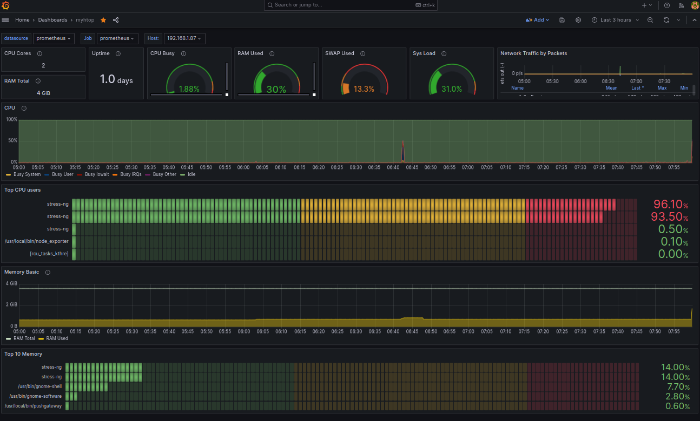

# **LINUX TOP PROCESS displayed on GRAFANA**

This grafana page displays the top cpu and memory users per application. There are a few other version of this out there, I created this version to make it easy to install. 




 built for **Grafana v10.2.6**


**ports**  (can be anything but must be consistant )
- grafana-server 3000
- prometheus server 9092
- node_exporter 9093
- pushgateway 9091
- getbig 9091

**client build**
```sh
curl -L -O https://github.com/prometheus/pushgateway/releases/download/v1.11.0/pushgateway-1.11.0.linux-amd64.tar.gz
tar zxvf pushgateway-1.11.0.linux-amd64.tar.gz -C .
cp  ./pushgateway-1.11.0.linux-amd64/pushgateway /usr/local/bin/

curl -L -O https://github.com/prometheus/node_exporter/releases/download/v1.8.2/node_exporter-1.8.2.linux-amd64.tar.gz
tar zxvf  node_exporter-1.8.2.linux-amd64.tar.gz -C.
cp node_exporter-1.8.2.linux-amd64/node_exporter /usr/local/bin/

groupadd node_exporter
groupadd pushgateway
useradd -s /sbin/nologin node_exporter -g node_exporter
useradd -s /sbin/nologin pushgateway -g pushgateway

chown node_exporter:node_exporter /usr/local/bin/node_exporter
chown pushgateway:pushgateway /usr/local/bin/pushgateway

curl -L -O  https://github.com/campat-git/grafana-top/archive/refs/heads/main.zip
unzip main.zip
cd grafana-top-main
cp getbig /usr/local/bin/
cp node_exporter.service /usr/lib/systemd/system/
cp pushgateway.service /usr/lib/systemd/system/
cp getbig.service /usr/lib/systemd/system/
systemctl daemon-reload

firewall-cmd --zone=public --permanent --add-port=9093/tcp
firewall-cmd --zone=public --permanent --add-port=9091/tcp
firewall-cmd --reload

systemctl enable --now  node_exporter.service
systemctl enable --now  pushgateway.service
systemctl enable --now  getbig.service
```

I have included multiple version of the same script in different languages, you only need to pick which one you want to uses. A python version is being worked on.

**getbig versions**  (pick any one)
*perl version needs*
```sh
dnf install -y perl-LWP-Protocol-https.noarch perl-Sys-Hostname.x86_64
```
*shell version* 
needs nothing

*rust version*
```sh
dnf install -y cargo
dnf install -y openssl-devel
cargo build --release
cargo fix --bin "getbig" --allow-no-vcs
cp getbig_src/target/release/getbig /usr/local/bin
```

```sh
systemctl enable --now  node_exporter.service
systemctl enable --now  pushgateway.service
systemctl enable --now  getbig.service
```

*Stress test your system to see if its all working*

```sh
stress-ng --cpu 0 --timeout 60s
stress-ng --vm 2 --vm-bytes 1G --timeout 60s --verify
```

rebuilding the rust binary 
```
cd src
cargo build --release
```

## License

MIT

